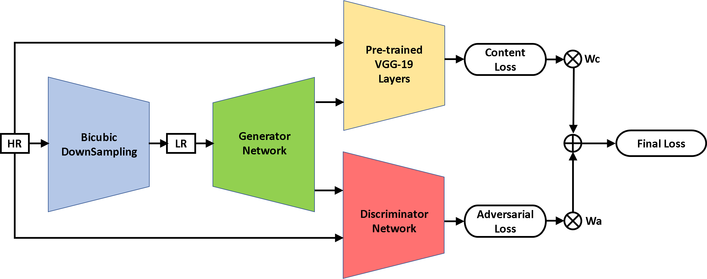
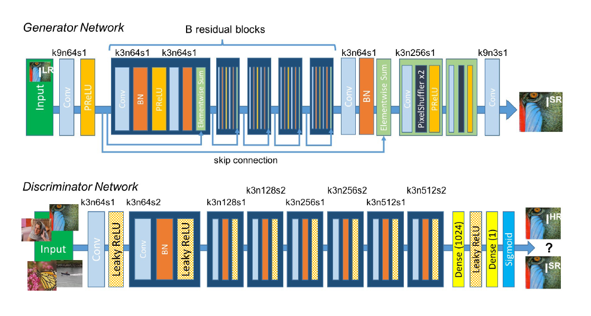
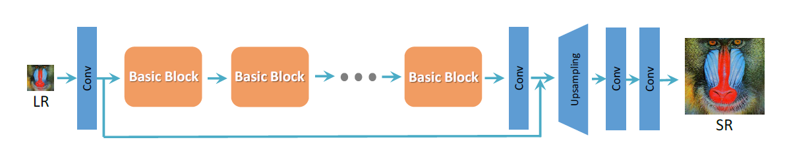
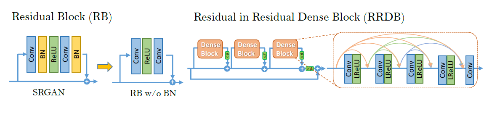

# SuperResolution-Keras

## Problem Statement
Enhancing low resolution images by applying deep network to produce high resolutions images.

## Concept Diagram    
</img>
    
## Reference Network Architectures
#### Generator & Discriminator Network of SRGAN 
</img> 
#### Generator Network of E-SRGAN 
</img> 
#### Basic Blocks of E-SRGAN Generator Network 
</img> 
    

## Network Details
- k3n64s1 this means kernel 3, channels 64 and strides 1.

## Working of GAN based Super-Resolution
- We downsample HR images to get LR images
- Generator is first trained for LR to SR generation, which has to be pixelwise close to HR (high PSNR)
- Discriminator is trained to distinguish SR & HR images, loss of which is backpropagated to train Generator further
- This game theoretic process will train generator to generate SR images that are indistinguishable from HR

## Data-sets
- DIV2K and Flickr2K datasest (jointly DIV2F) for training
- Set5, Set14, BSDS100, Urban100, Manga109 for testing purposes

     
## Source Files
- main.py              : Contains all running procedures
- myutils.py           : Custom keras layers & function implementations
- models_collection.py : File containing all architecture definitions for fast protyping on changes

## Implementation
- [x] Data reading & LR generation, with support for heterogenous & multiformat images
- [x] Disk batching for control over memory usage by limited amount of data feeding
- [x] Model as layer, dictionary based arguments & non-comparative model training 
- [x] GAN model with sub-models, and configuring layers for model API
- [x] Model parser function for easier prototyping
- [x] PixelShuffle & DeShuffle keras layers
- [x] Learnable Weighted sum keras layer
- [x] Plotting functions for Training progress
- [x] Saving & Training resuming tricks for composite models
- [x] MIX loss function with its Adaptive variant
- [ ] Data augmentation Class for MUlti I/O keras models
- [ ] Hybrid Padding for Testing on very large images
- [ ] Attention Mechanism in GAN
- [ ] Bicubic UpSampling layer
- [ ] Network Interpolation
           
## Learning
- Residual learning helps a lot in training of deep neural networks
- Perceptual loss can be useful for domains like Image Style Transfer and Photo Realistic Style Transfer also.
- Data sollection is an import aspect, using images with high quality data, quality above quantity, as we have augmentation.

## Results

### SRResNet Results
#### Normal Training PSNR Gain
DataSet Name | Minimum | Maximum | Mean    | Median  | Standard Deviation
------------ | :-----: | :-----: | :-----: | :-----: | :-----: 
DIV2K        | 0.1340  | 3.6828  | 1.3501  | 1.1362  | 0.7683
Set5         | 0.6227  | 4.0698  | 2.1655  | 1.9665  | 1.3567
Set14        | 0.3126  | 3.3328  | 1.4685  | 1.2384  | 0.9801
BSDS100      | 0.0241  | 4.5538  | 1.2028  | 1.0678  | 0.8341
Urban100     | 0.3071  | 6.3944  | 1.6101  | 1.2864  | 1.0600
Manga109     | 0.4461  | 6.0257  | 3.0673  | 3.0346  | 0.9606

#### Fine Tuning PSNR Gain
DataSet Name | Minimum | Maximum | Mean    | Median  | Standard Deviation
------------ | :-----: | :-----: | :-----: | :-----: | :-----: 
DIV2K        | 0.4961  | 5.2995  | 1.6905  | 1.4589  | 1.0193
Set5         | 0.8236  | 4.4487  | 2.6640  | 3.0197  | 1.4554
Set14        | 0.4086  | 3.7932  | 1.7533  | 1.5810  | 1.0708
BSDS100      | 0.1496  | 5.6223  | 1.4077  | 1.2298  | 0.9561
Urban100     | 0.3184  | 6.7475  | 1.8952  | 1.5763  | 1.1998
Manga109     | 1.2940  | 6.6388  | 3.8610  | 3.7790  | 1.1522

## Outputs

	
	
	
	
 

## Usage

## References
#### Papers
- [Photo-Realistic Single Image Super-Resolution Using a Generative Adversarial Network](https://arxiv.org/abs/1609.04802)
- [ESRGAN: Enhanced Super-Resolution Generative Adversarial Networks](https://arxiv.org/abs/1809.00219)
- [Perceptual Losses for Real-Time Style Transfer and Super-Resolution](https://cs.stanford.edu/people/jcjohns/papers/eccv16/JohnsonECCV16.pdf)
- [Efficient Super Resolution For Large-Scale Images Using Attentional GAN](https://arxiv.org/abs/1812.04821)
<a/>

#### Helpful Resources
- [Getting started with the Keras functional API](https://keras.io/getting-started/functional-api-guide/)
- [VGG usage in keras](https://machinelearningmastery.com/use-pre-trained-vgg-model-classify-objects-photographs/)
- [Various GANS implemented in Keras including SRGAN](https://github.com/eriklindernoren/Keras-GAN)
- [VGG loss help](https://blog.sicara.com/keras-generative-adversarial-networks-image-deblurring-45e3ab6977b5)
- [Improved Techniques for Training GANs](https://arxiv.org/abs/1606.03498) 
- [Data Augmentation using Multiple Inputs](https://stackoverflow.com/questions/49404993/keras-how-to-use-fit-generator-with-multiple-inputs)
- [Data Augmentation using Multiple Outputs](https://github.com/keras-team/keras/issues/7003)
<a/>

#### Similar Projects
- https://github.com/titu1994/Super-Resolution-using-Generative-Adversarial-Networks
- https://github.com/brade31919/SRGAN-tensorflow
- https://github.com/MathiasGruber/SRGAN-Keras
- https://github.com/tensorlayer/srgan
<a/> 

## Requirements
You will need the following to run the above:
- Version of numpy 1.16.4
- Version of matplotlib 3.0.3
- Version of tensorflow 1.14.0
- Version of h5py 2.8.0
- Version of keras 2.2.5
- Version of PIL 4.3.0    
<a/>

<!--https://gist.github.com/rxaviers/7360908-->
Essential Hardware Requirement: A decent NVIDIA GPU :stuck_out_tongue_winking_eye:
